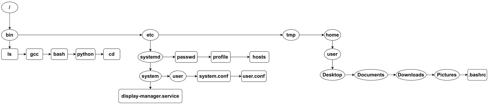
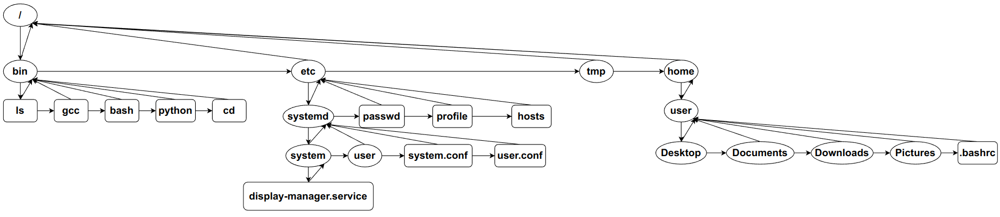

# File Management System <!-- omit in toc -->

**Table of Contents**
- [Defining the Problem Statement:](#defining-the-problem-statement)
- [Selecting the Data Structure:](#selecting-the-data-structure)
- [Execution of Solution:](#execution-of-solution)
- [Algorithms](#algorithms)
  - [print_tree(root, prev_struct)](#print_treeroot-prev_struct)
  - [print_ls(node=pwd->child)](#print_lsnodepwd-child)
  - [pwd_str(root, pwd)](#pwd_strroot-pwd)
  - [find_names(root, pwd, name)](#find_namesroot-pwd-name)
  - [find_on_pwd(pwd, name)](#find_on_pwdpwd-name)
  - [find_node(root, pwd, path)](#find_noderoot-pwd-path)
  - [cd(root, pwd, path)](#cdroot-pwd-path)
  - [create(root, pwd, path, type)](#createroot-pwd-path-type)
  - [remove(root, pwd, path)](#removeroot-pwd-path)
  - [dupl(root, pwd, src_path, dst_path, keep)](#duplroot-pwd-src_path-dst_path-keep)
  - [cat(root, pwd, path)](#catroot-pwd-path)
  - [edit(root, pwd, path)](#editroot-pwd-path)
  - [chmod(root, pwd, path, new_modes)](#chmodroot-pwd-path-new_modes)
- [Dry Run](#dry-run)

## Defining the Problem Statement:

Data on every Operating System is stored in a hierarchical file system
constituted of directories and subdirectories beneath them. A file
management system is the program used to arrange these files, move them,
and create / delete them. This take care of how the files are organized
rather than how they are stored.

The key features are to:

-   Create, modify, move, copy, delete and other file operations.

-   Add or edit basic metadata.

## Selecting the Data Structure:

Trees would be the best suited data structure to implement this because
nodes and leaves of the tree resemble the directories and
sub-directories containing files in them.

A binary tree cannot do the job here as it restricts to only having two
children. N-ary Tree should be implemented solve this. Since we do not
know what will be the value of n, each node cannot have a fixed child
links.


But if we think this as keeping the contents of a directory as a linked
list and only storing the first child’s address, then each node can have
exactly 2 links. This makes it possible to use algorithms of Binary Tree
as well.



There is also a need to traverse upwards to its root. This can be solved
by creating another link with the parent directory. Although this
technically becomes a Graph, but implementation will be like a binary
tree in a broad level and like linked list in a directory level.



## Execution of Solution:

The execution is very much inspired from Linux shell. The program
resembles the shell which contains the present working directory on left
and prompt at end. The user can use following commands just like in the
Linux shell. Some key commands are:

-   **cd** - to navigate through directories

-   **ls** - to list the files and sub-directories in a directory

-   **tree** – to view a tree structure of what is inside a directory
    until the last file

-   **mkdir** – to create a new directory

-   **touch** – to create a new file

-   **edit** – to edit the file contents

-   **rm** / **rmdir** – to remove a file / directory respectively

-   **cp** / **mv** – to copy / move a file or directory respectively

-   **find** – to find files or directories

Examples:

```bash
cd /home/user
ls
tree /
touch prog1.c
edit prog1.c
mkdir c_programs
mv prog1.c c_programs/
```

The input is taken as list of strings and appropriate functions are
called along with the arguments (i.e., path or name) passed. Since the
argument can be with respect to **root** or **pwd**, these 2 pointer
variables are necessary in the main function. In case of path, each
separate functions should **cd** into that path and run the operations.

-   Creation will just be like adding a node at end of linked list.

-   Deletion will just be like deleting a node from linked list.

-   Traversal will just be like traversing binary tree in pre-order.


## Algorithms

**Structure of a node**:

>string name <br />
list<string> content <br />
char type <br />
string create_time <br />
string modify_time <br />
int perm <br />
node pointer link <br />
node pointer child <br />
node pointer parent <br />

**n** = Total number of nodes ; **m** = number of nodes in a directory ; **h** = height of tree

---
### print_tree(root, prev_struct)
This algorithm prints all node names from root in a form of tree
```python
START
1.  if  (root is not null)
        set struct to prev_struct+branch
        print struct+name
        print_tree(root->child, struct)
        print_tree(root->link, prev_struct)
	end if
STOP
```
> Time Complexity = O(n) <br />
Auxiliary Space = O(n)

---
### print_ls(node=pwd->child)
This algorithm prints all node name in a directory
```python
START
1.  if (node in not null)
    print name
    print_ls(node->link)
    end if
STOP
```
> Time Complexity = O(m) <br />
Auxiliary Space = O(1)

---
### pwd_str(root, pwd) 
This algorithm returns the complete path of a node with respect to root 
```python
START 
1.  set path to empty string 
2.  if  (pwd is root)
        return “/”
	end if
3.  loop (while pwd is not root)
        set path to “/”+name+path
        set pwd to pwd->parent
	end loop
4.  return path
STOP
```
> Time Complexity = O(h) <br />
Auxiliary Space = O(h)

---
### find_names(root, pwd, name)
This algorithm returns the complete list of all nodes' path containing a given string
```python
START
1.  declare static list of string result
2.  if (root is pwd)
        clear result
    end if
3.  if (pwd is not null)
        set path to pwd_str(root, pwd)
        if (name in path)
            push path into end of result
        end if
        find_names(root, pwd->child, name)
        find_names(root, pwd->link, name)
    end if
4.  return result
STOP
```
> Time Complexity = O(n*h) <br />
Auxiliary Space = O(n)

---
### find_on_pwd(pwd, name)
This algorithm returns the node of desired name on present working directory
```python
START
1.  set pwd to pwd->child
2.  loop (while pwd is not null)
        if (both names are same)
            return pwd
        end if
        set pwd to pwd->link
3.  return null
STOP
```
> Time Complexity = O(m) <br />
Auxiliary Space = O(1)

---
### find_node(root, pwd, path)
This algorithm returns the node of desired path with respect to root or pwd
```python
START
1.  get parent_path and name from path
2.  set pwd to cd(root, pwd, parent_path)
3.  if (pwd in null) return null
4.  return find_on_pwd(pwd, name)
STOP
```
> Time Complexity = O(m*h) <br />
Auxiliary Space = O(1)

---
### cd(root, pwd, path)
This algorithm returns the directory of desired path with respect to root or pwd
```python
START
1.  set path_list to split(path, '/')
2.  if (path_list[0] is empty string)
        set node to root
        pop first element from path_list
    else if (path_list[0] = ".")
        if (length of path_list is 1)
            return pwd
        else
            set node to pwd
            pop first element from path_list
        end if
    else if (path_list[0] = "..")
        if (length of path_list is 1)
            return pwd->parent
        else
            set node to pwd->parent
            pop first element from path_list
    else
        set node to pwd
    end if
3.  loop (for each element in path_list)
        set node to find_on_pwd(node, element)
        if (node is not null or node is not a directory)
            print path does not exist
            return null
        end if
    end loop
4.  return node   
STOP
```
> Time Complexity = O(m*h) <br />
Auxiliary Space = O(h)

---
### create(root, pwd, path, type)
This algorithm creates and returns a new node of the given path and type
```python
START
1.  get parent_path and name from path
2.  set new_pwd to cd(root, pwd, parent_path)
3.  if (new_pwd is null)
        print parent_path does not exist
        return null
    end if
4.  set node to find_on_pwd(new_pwd, name)
5.  if (new_pwd is not null)
        print path already exists
        if (do not want to overwrite) return null
        remove(root, new_pwd, name)
    end if
6.  set node to new TreeNode(new_pwd, name)
7.  set node->type to type
8.  set node->parent to new_pwd
9. set temp to new_pwd->child
10. if (temp is null)
        temp = node
        return node
    end if
11. loop (while temp->link is not null)
        temp = temp->link
    end loop
12. temp->link = node
13. return node
STOP
```
> Time Complexity = O(m*h) <br />
Auxiliary Space = O(1)

---
### remove(root, pwd, path)
This algorithm removes the node of given path
```python
START
1.  set node to find_node(root, pwd, path)
2.  if (node is null)
        print path does not exist
        return
    end if
3.  if (node is not empty directory)
        print path is not empty
        if (not want to proceed) return
    end if
4.  set temp to node->parent->child
5.  if (temp is node)
        temp = node->link
        return
    end if
6.  loop (while temp->link is not null)
        temp = temp->link
7.  temp->link = node->link
STOP
```
> Time Complexity = O(m*h) <br />
Auxiliary Space = O(1)

---
### dupl(root, pwd, src_path, dst_path, keep)
This algorithm copies or moves the node from src_path to dst_path
```python
START
1.  set src_node to find_node(root, pwd, src_path)
2.  if (src_node is null)
        print src_path does not exist
    end if
3.  store src_node data
4.  set dst_node to find_node(root, pwd, dst_path)
5.  if (dst_node is a directory)
        set dst_path to dst_path+"/"+src_name
    end if
6.  set node to create(root, pwd, dst_path, src_node->type)
7.  if (node is not null)
        set node data to src_node data
    else
        return
8.  if (not keep)
        remove(root, pwd, src_path)
    end if
STOP
```
> Time Complexity = O(m*h) <br />
Auxiliary Space = O(1)

---
### cat(root, pwd, path)
This algorithm displays the contents of the file in given path
```python
START
1.  set node to find_node(root, pwd, path)
2.  if (node is null)
        print path does not exist
        return
    end if
3.  if (node is not file)
        print path is not a file
        return
    end if
4.  if (node does not have read permission)
        print path does not have read permission
        return
    end if
5.  loop (for each line in node->content) print line
STOP
```
> Time Complexity = O(m*h) <br />
Auxiliary Space = O(1)

---
### edit(root, pwd, path)
This algorithm change the contents of file in given path
```python
START
1.  set node to find_node(root, pwd, path)
2.  if (node is null)
        if (create new file)
            set node to create(root, pwd, path, '-')
        else
            return
        end if
    end if
3.  if (node is not a file)
        print path is not a file
        return
    end if
4.  if (file is not empty)
        if (node does not have read permission)
            print path does not have read permission
        else
            print contents of file
        end if
        if (node does not have write permission)
            print path does not have write permission
            return
        end if
        if (not overwrite) return
5.  clear node->content
6.  read lines as string and push to node->content
STOP
```
> Time Complexity = O(m*h) <br />
Auxiliary Space = O(1)

---
### chmod(root, pwd, path, new_modes)
This algorithm changes the permissions of the node
```python
START
1.  set node to find_node(root, pwd, path)
2.  if (node is null)
        print path does not exist
        return
    end if
3.  set prev_modes to node->perm_str
4.  if (length of new_modes is 1 and new_modes is between '0' and '7')
        set node->perm to corresponding int value
    end if
5.  loop (for each character in new_modes)
        if (character is valid permission and not in prev_modes)
            if (new_modes[0] is '+')
                update node->perm by adding those permissions
            else if (new_modes[0] is '-')
                update node->perm by removing those permissions
            end if
        else
            print permission string already exists or invalid
        end if
    end loop
STOP
```
> Time Complexity = O(m*h) <br />
Auxiliary Space = O(1)

---

## Dry Run
File System before Dry Run,


```bash
cd /home/user
```
1. path_list = {"home", "user"}
2. node = root
3. looping path_list
   1. node = find_on_pwd(node, "home")
   2. node = find_on_pwd(node, "user")
4. return node
   
```bash
ls
```
1. print "Desktop/"
2. print "Documents/"
3. print "Downloads/"
4. print "Pictures/"
5. print ".bashrc"

```bash
touch prog1.c
```
1. parent_path = ""
2. new_pwd = pwd
3. node = find_on_pwd(new_pwd, "prog1.c")
4. node = new TreeNode(new_pwd, "prog1.c")
5. node->type = type
6. temp = new_pwd->child
7. when temp->link == NULL, temp->link = node
8. return node