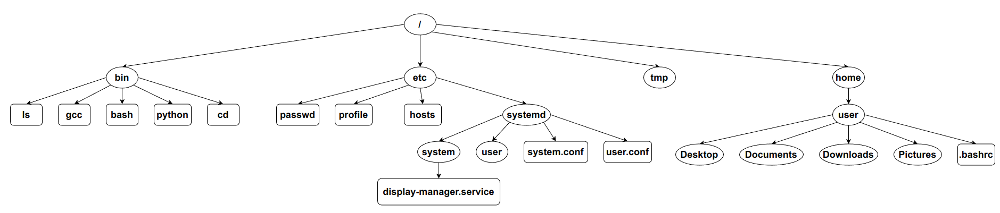

# File Management System

## Defining the Problem Statement:

Data on every Operating System is stored in a hierarchical file system
constituted of directories and subdirectories beneath them. A file
management system is the program used to arrange these files, move them,
and create / delete them. This take care of how the files are organized
rather than how they are stored.

The key features are to:

-   Create, modify, move, copy, delete and other file operations.

-   Add or edit basic metadata.

## Selecting the Data Structure:

Trees would be the best suited data structure to implement this because
nodes and leaves of the tree resemble the directories and
sub-directories containing files in them.

A binary tree cannot do the job here as it restricts to only having two
children. N-ary Tree should be implemented solve this. Since we do not
know what will be the value of n, each node cannot have a fixed child
links.



But if we think this as keeping the contents of a directory as a linked
list and only storing the first child’s address, then each node can have
exactly 2 links. This makes it possible to use algorithms of Binary Tree
as well.


There is also a need to traverse upwards to its root. This can be solved
by creating another link with the parent directory. Although this
technically becomes a Graph, but implementation will be like a binary
tree in a broad level and like linked list in a directory level.


## Execution of Solution:

The execution is very much inspired from Linux shell. The program
resembles the shell which contains the present working directory on left
and prompt at end. The user can use following commands just like in the
Linux shell. Some key commands are:

-   **cd** - to navigate through directories

-   **ls** - to list the files and sub-directories in a directory

-   **tree** – to view a tree structure of what is inside a directory
    until the last file

-   **mkdir** – to create a new directory

-   **touch** – to create a new file

-   **edit** – to edit the file contents

-   **rm** / **rmdir** – to remove a file / directory respectively

-   **cp** / **mv** – to copy / move a file or directory respectively

-   **find** – to find files or directories

Examples:

```
cd /home/user
ls
tree /
touch prog1.c
edit prog1.c
mkdir c_programs
mv prog1.c c_programs/
```

The input is taken as list of strings and appropriate functions are
called along with the arguments (i.e., path or name) passed. Since the
argument can be with respect to **root** or **pwd**, these 2 pointer
variables are necessary in the main function. In case of path, each
separate functions should **cd** into that path and run the operations.

-   Creation will just be like adding a node at end of linked list.

-   Deletion will just be like deleting a node from linked list.

-   Traversal will just be like traversing binary tree in pre-order.
